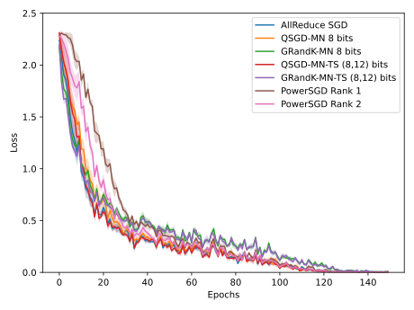
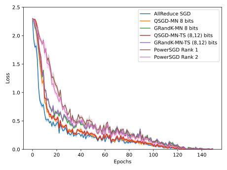
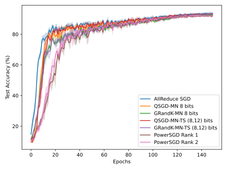

  [![Contributors][contributors-shield]][contributors-url] [![Forks][forks-shield]][forks-url] [![Stargazers][stars-shield]][stars-url] [![Issues][issues-shield]][issues-url] [![MIT License][license-shield]][license-url] [![LinkedIn][linkedin-shield]][linkedin-url]

<!-- PROJECT LOGO -->
<br />

<p align="center">
  <h2 align="center">Quantization for Distributed Optimization</h2>
  <p align="center">
    <a href=https://github.com/vineeths96/Gradient-Compression><strong>Explore the repository»</strong></a>
    <br />
    <a href=https://arxiv.org/abs/2109.12497>View Paper</a>
  </p>


</p>

> tags : distributed optimization, large-scale machine learning, gradient compression, edge learning, federated learning, deep learning, pytorch 


### Code for the paper [Quantization for Distributed Optimization](https://arxiv.org/abs/2109.12497).


<!-- ABOUT THE PROJECT -->

## About The Project

Massive amounts of data have led to the training of large-scale machine learning models on a single worker inefficient. Distributed machine learning methods such as Parallel-SGD have received significant interest as a solution to tackle this problem. However, the performance of distributed systems does not scale linearly with the number of workers due to the high network communication cost for synchronizing gradients and parameters. Researchers have proposed techniques such as quantization and sparsification to alleviate this problem by compressing the gradients. Most of the compression schemes result in compressed gradients that cannot be directly aggregated with efficient protocols such as all-reduce. In this paper, we present a set of all-reduce compatible gradient compression algorithms - QSGDMaxNorm Quantization, QSGDMaxNormMultiScale Quantization, and its sparsified variants - which significantly reduce the communication overhead while maintaining the performance of vanilla SGD. We establish upper bounds on the variance introduced by the quantization schemes and prove its convergence for smooth convex functions. The proposed compression schemes can trade off between the communication costs and the rate of convergence. We empirically evaluate the performance of the compression methods by training deep neural networks on the CIFAR10 dataset. We examine the performance of training ResNet50 (computation-intensive) model and VGG16 (communication-intensive) model with and without the compression methods. We also compare the scalability of these methods with the increase in the number of workers. Our compression methods perform better than the in-built methods currently offered by the deep learning frameworks.

### Built With
This project was built with 

* python v3.7.6
* PyTorch v1.7.1
* The environment used for developing this project is available at [environment.yml](environment.yml).


<!-- GETTING STARTED -->

## Getting Started

Clone the repository into a local machine using,

```shell
git clone https://github.com/vineeths96/Gradient-Compression
cd Gradient-Compression/
```

### Prerequisites

Create a new conda environment and install all the libraries by running the following command

```shell
conda env create -f environment.yml
```

The dataset used in this project (CIFAR 10) will be automatically downloaded and setup in `data` directory during execution.

### Instructions to run

The training of the models can be performed on a distributed cluster with multiple machines and multiple worker GPUs. We make use of `torch.distributed.launch` to launch the distributed training. More information is available [here](https://pytorch.org/tutorials/beginner/dist_overview.html).

To launch distributed training on a single machine with multiple workers (GPUs), 

```shell
python -m torch.distributed.launch --nproc_per_node=<num_gpus> trainer.py --local_world_size=<num_gpus> 
```

 To launch distributed training on multiple machine with multiple workers (GPUs), 

```sh
export NCCL_SOCKET_IFNAME=ens3

python -m torch.distributed.launch --nproc_per_node=<num_gpus> --nnodes=<num_machines> --node_rank=<node_rank> --master_addr=<master_address> --master_port=<master_port> trainer.py --local_world_size=<num_gpus>
```


## Model overview

We conducted experiments on [ResNet50](https://arxiv.org/abs/1512.03385) architecture and [VGG16](https://arxiv.org/abs/1409.1556) architecture. Refer the original papers for more information about the models. We use publicly available implementations from [GitHub](https://github.com/kuangliu/pytorch-cifar) for reproducing the models. 


<!-- RESULTS -->

## Results

We highly recommend to read through the [paper](https://arxiv.org/abs/2109.12497) before proceeding to this section. The paper explains the different compression schemes we propose and contains many more analysis & results than what is presented here. 

We begin with an explanation of the notations used for the plot legends in this section. *AllReduce-SGD* corresponds to the default gradient aggregation provided by PyTorch. *QSGD-MN* and *GRandK-MN* corresponds to *QSGDMaxNorm Quantization* and *GlobalRandKMaxNorm Compression* respectively. The precision or number of bits used for the representation follows it. *QSGD-MN-TS* and *GRandK-MN-TS* corresponds to *QSGDMaxNormMultiScale Quantization* and *GlobalRandKMaxNormMultiScale Compression* respectively, with two scales (TS) of compression. The precision or number of bits used for the representation of the two scales follows it. For the sparsified schemes, we choose the value of K as 10000 for all the experiments. We compare our methods with a recent all-reduce compatible gradient compression scheme *PowerSGD* for Rank-1 compression and Rank-2 compression. 

|                           ResNet50                           |                            VGG16                             |
| :----------------------------------------------------------: | :----------------------------------------------------------: |
|   Loss Curve    |     Loss Curve     |
| Accuracy Curve  |   Accuracy Curve   |
| Scalability with number of GPUs | Scalability with number of GPUs |


<!-- LICENSE -->

## License

Distributed under the MIT License. See `LICENSE` for more information.


<!-- CONTACT -->

## Contact

Vineeth S - vs96codes@gmail.com

Project Link: [https://github.com/vineeths96/Gradient-Compression](https://github.com/vineeths96/Gradient-Compression)


<!-- MARKDOWN LINKS & IMAGES -->
<!-- https://www.markdownguide.org/basic-syntax/#reference-style-links -->

[contributors-shield]: https://img.shields.io/github/contributors/vineeths96/Gradient-Compression.svg?style=flat-square
[contributors-url]: https://github.com/vineeths96/Gradient-Compression/graphs/contributors
[forks-shield]: https://img.shields.io/github/forks/vineeths96/Gradient-Compression.svg?style=flat-square
[forks-url]: https://github.com/vineeths96/Gradient-Compression/network/members
[stars-shield]: https://img.shields.io/github/stars/vineeths96/Gradient-Compression.svg?style=flat-square
[stars-url]: https://github.com/vineeths96/Gradient-Compression/stargazers
[issues-shield]: https://img.shields.io/github/issues/vineeths96/Gradient-Compression.svg?style=flat-square
[issues-url]: https://github.com/vineeths96/Gradient-Compression/issues
[license-shield]: https://img.shields.io/badge/License-MIT-yellow.svg
[license-url]: https://github.com/vineeths96/Gradient-Compression/blob/master/LICENSE
[linkedin-shield]: https://img.shields.io/badge/-LinkedIn-black.svg?style=flat-square&logo=linkedin&colorB=555
[linkedin-url]: https://linkedin.com/in/vineeths

